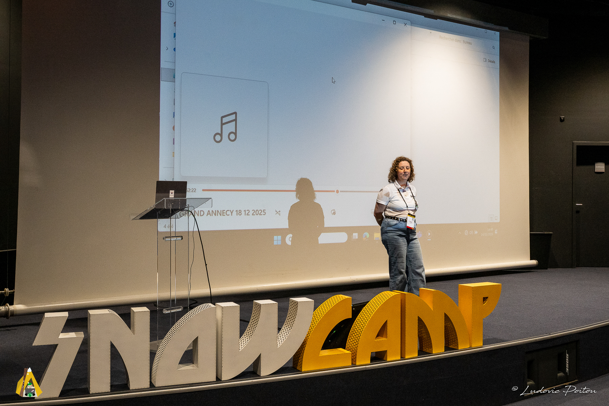
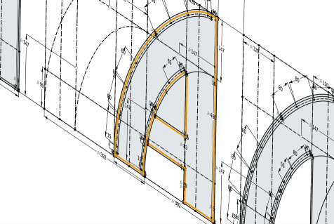
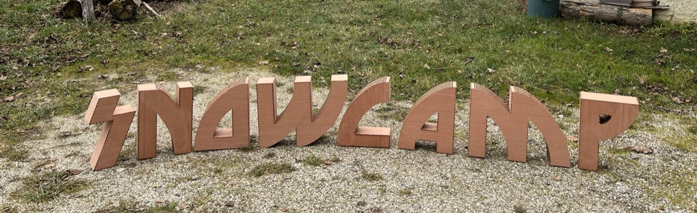
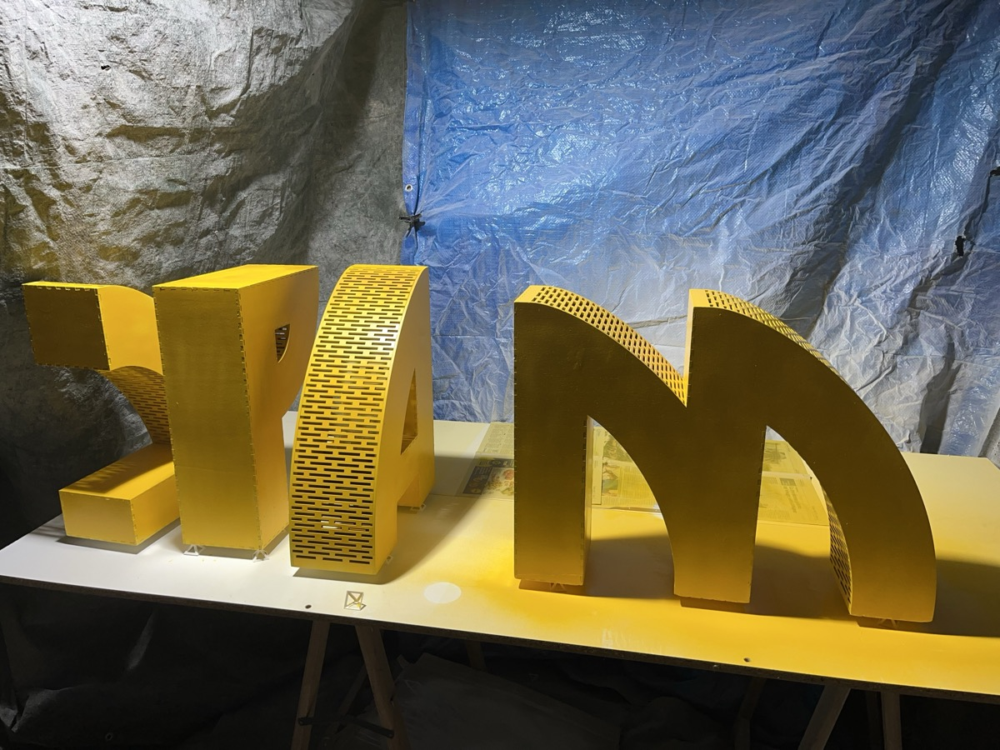

# Logo Snowcamp en contreplaqué

Ce projet documente la création du logo Snowcamp en contreplaqué qui est affiché sur la scène de la conférence.

## Conception 3D

La conception 3D des lettres a été faite depuis le logiciel OnShape.

Le document de conception est disponible depuis [ce lien](https://cad.onshape.com/documents/e505e8593a2fc47bad0547f7/w/a2e19de377bd4450dc694335/e/f0019e91c5ae519defc0f1de?renderMode=6&uiState=696641a15a318394398b9e02)

[Voir les détails de la section conception 3D](/conception.md)

## Découpe laser

La découpe laser a été faite au [FabLab de la Casemate à Grenoble](https://fablab.lacasemate.fr/) avec la machine Trotec SP 500

[Voir les détails de la section découpe laser](/decoupe_laser.md)

## Assemblage

[Voir les détails de la section assemblage](/assemblage.md)

## Peinture

[Voir les détails de la section peinture](/peinture.md)

## Fichiers de découpes et d'impression 3D

En cas de casse ou autre besoin de recréer des lettres pour le logo Snowcamp, le fichier de découpe est le suivant:
- [LaserCutInkscape.svg](/src/LaserCutInkscape.svg)

Ce fichier est conçu pour la découpeuse laser Trotec 500 disponible au FabLab de Grenoble

Pour la création des contrepoids, les fichiers d'impression 3D sont les suivants:
- [snowcamp_poids_P.3mf](/src/snowcamp_poids_P.3mf)
- [snowcamp_poids_S.3mf](/src/snowcamp_poids_S.3mf)
- [snowcamp_poids_W.3mf](/src/snowcamp_poids_W.3mf)
- [snowcamp_poids_P_lid.3mf](/src/snowcamp_poids_P_lid.3mf)
- [snowcamp_poids_S_lid.3mf](/src/snowcamp_poids_S_lid.3mf)
- [snowcamp_poids_W_lid.3mf](/src/snowcamp_poids_W_lid.3mf)

Avant d'utiliser ces fichiers, lire le fichier [ameliorations.md](/ameliorations.md) ainsi que les détails techniques [pour la découpe](/decoupe_laser.md) et [pour l'impression 3D](/fichier_impression3D.md).

## Bill of Materials

[Voir la liste des matériaux et outils utilisés](/BOM.md)
