# Conception

La conception 3D des lettres en contreplaqué a été faite depuis le logiciel [OnShape](https://www.onshape.com/fr/)

## Vectorisation de notre logo

La première étape a été de partir de notre logo PNG et de le vectoriser dans OnShape.

Notre logo avait été créé depuis la police d'écriture [Die Nasty](https://www.dafont.com/die-nasty.font)

La vectorisation a été faite manuellement dans un Sketch depuis OnShape avec le logo PNG pour référence.

Le résultat est le suivant:
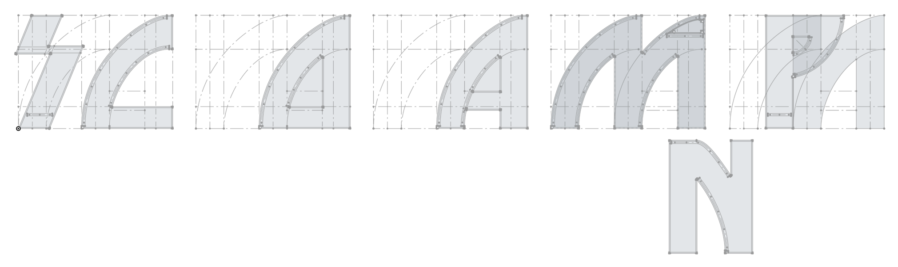

Plus de détails sur la vectorisation du logo et les contraintes techniques rencontrée sont disponibles dans le document [/technical_details/vectorisation.md](/technical_details/vectorisation.md)

## Création du volume

Le logo final doit contenir des lettres de 16 cm de profondeur ([plus de détails](/technical_details/dimensions.md#profondeur-des-lettres)).
 
Pour la mise en volume, nous avons créé une marge de 5mm (épaisseur du contreplaqué) sur tous les bords des lettres dans les sketchs 2D de OnShape.

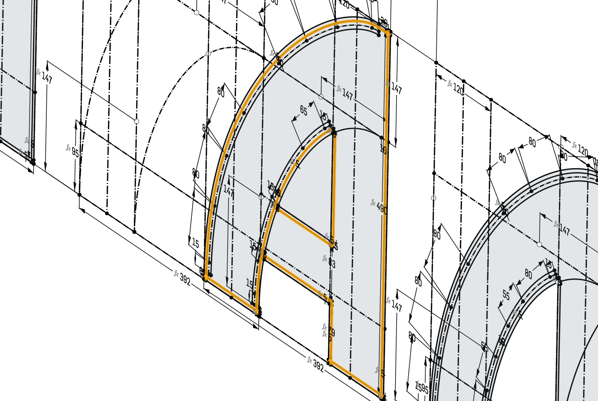

Ensuite nous avons utilisé la fonction d'extrusion en 4 temps:
- D'abord toutes les faces avant et arrières
- Ensuite toutes les parois horizontales
- Ensuite toutes les parois verticales
- Enfin toutes les parois courbes

Le faire en 4 temps permet de s'assurer que chaque paroi est extrudée dans une étape différente de ses voisines, ce qui permet d'avoir automatiquement une pièce différente générée pour chaque paroi. Sans cette étape des pièces voisines auraient été perçues comme une seule et même pièce par OnShape.

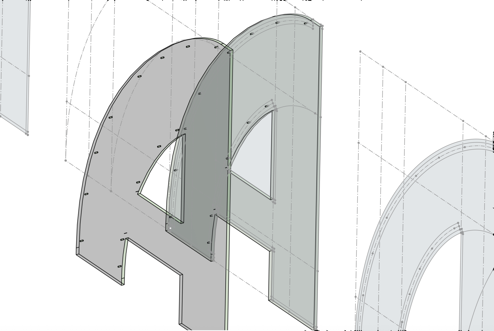
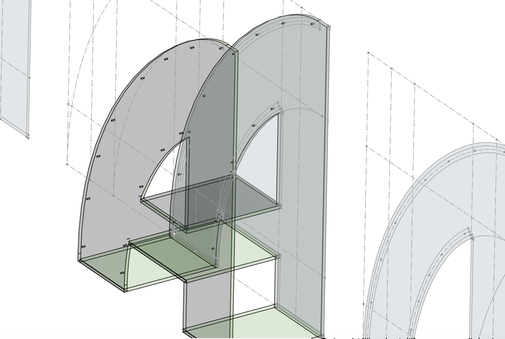
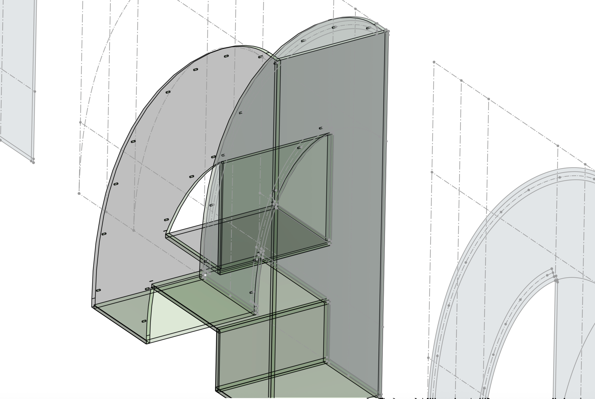

> [!WARNING]
> Pour permettre l'étape suivante de création des jointures, il est important que toutes les pièces se chevauchent.

## Création des jointures

Pour l'assemblage entre les pièces nous avons créé des jointures de type `Box Joint` ([plus de détails](/technical_details/box_joint.md)).

Le script de création des `Box Joint` a tout généré automatiquement.

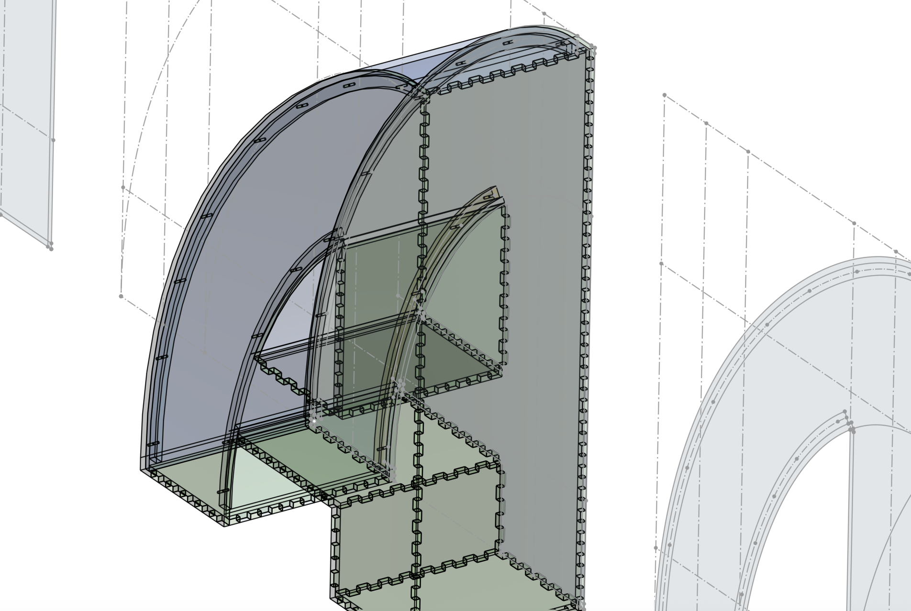

## Gestion des courbes

Les pièces courbes ne sont pas supportées telles quelles par la découpeuse laser. Celle-ci ne peut gérer que des pièces plates car le document d'export utilisé sera en 2D.

Pour permettre leur découpe nous sommes passé par la fonction [Sheet Metal Model](https://www.onshape.com/en/features/sheet-metal) de OnShape.

Au niveau des paramètres nous avons utilisé l'onglet `Thicken` avec une épaisseur de 5mm (épaisseur du contreplaqué).

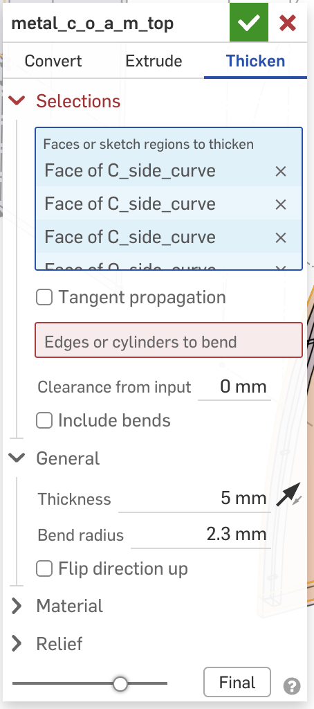

Le contreplaqué étant rigide, plus tard nous avons créé un `Living Hinge` sur les parois courbes ([plus de détails](/technical_details/living_hinge.md)).

## Support des courbes

Pour les parois courbes, nous n'avons pas souhaité avoir des jonctions de type `Box Joint` sur la partie courbe, nous pensons que cela aurait été disgracieux.

A la place nous avons choisi de faire tenir la paroi courbe en sandwich entre les deux faces arrière et avant.

Pour que la paroi courbe soit tout de même maintenue, un système de gouttière a été mis en place. Ce système consiste en des guides de 5mm d'épaisseur qui seront collé contre les faces avant et arrière et qui serviront de support pour les parois courbes qui viendront en appui contre les guides.

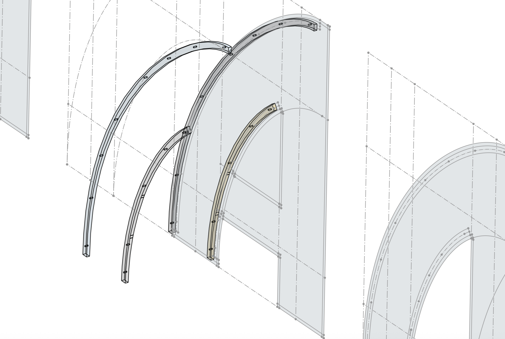
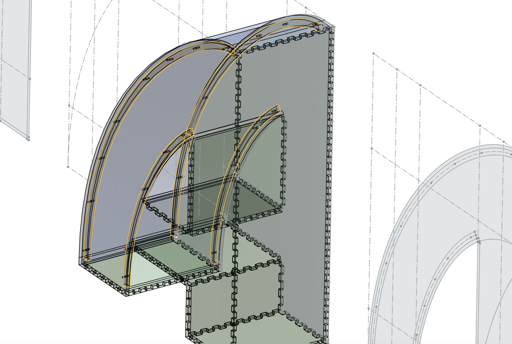

## Alignement des supports des parois courbes

Les supports des parois courbes servent d'appui pour que les parois arrivent à ras des bordures de la lettre. Il est donc important de pouvoir les positionner précisément.

Pour ce faire nous avons prévu des axes de guidages tout le long de ces supports. Ces axes sont des trous prévus à la bonne dimension pour faire passer des cure-dents qui serviront d'axe ([plus de détails](/technical_details/cure_dents.md)).

## Contrepoids

Certaines lettres comme le S, le P et le W ne sont pas suffisamment stables pour tenir toutes seules. Un système de contrepoids a donc été mis en place ([plus de détails](/technical_details/contrepoids.md)).

## Préparation de l'export

Pour pouvoir découper les pièces au laser, nous avons dû créer un plan de découpe en 2D.

Au moment de le faire nous n'avons pas trouvé de solution réellement automatisée et qui prenne en compte les dimensions de la surface de découpe de la découpeuse laser.

Nous avons donc mis en place un système D en mettant toutes les pièces dans un document `Assembly` dans OnShape et en les plaçant à peu près à plat dans des zones modélisées avec les dimensions de la découpeuse laser.

Nous avons fait aussi un travail de réflexion pour optimiser au mieux le positionnement des pièces sur les surfaces de découpe pour économiser la matière.

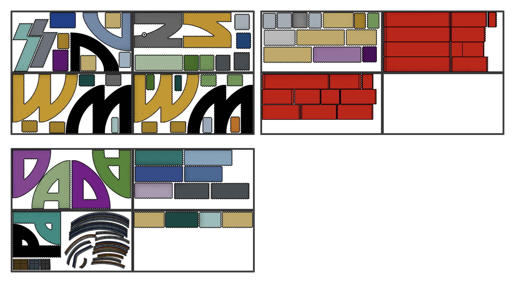

> [!WARNING]
> La fonction `Sheet Metal Model` a découpé certaines courbes là où il ne fallait pas. Nous n'avons pas trouvé comment empêcher ce phénomène, donc à la place dans le document `Assembly` nous avons re-joint ces pièces entre elles. Cela demandera un traitement supplémentaire dans Inkscape plus tard.

Ce qui est important est que les pièces soient correctement positionnées sur les axes X et Y, mais elles n'ont pas besoin d'être alignées sur l'axe Z qui disparaitra à l'export. Les outils de positionnement de OnShape étant limités cela nous a permis de gagner du temps en ignorant cette dimension.

Comme on peut le voir sur cette images, les pièces ne sont pas alignées sur l'axe Z.
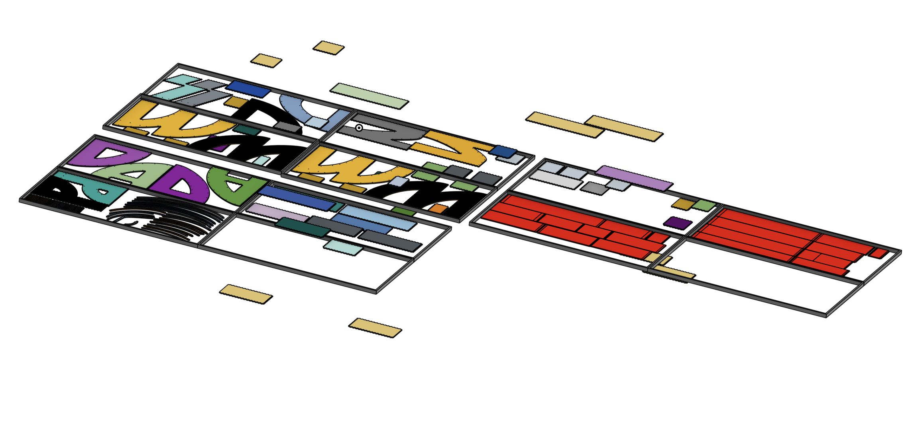

Une fois ce positionnement fait, nous avons dû créer un document `Drawing` dans OnShape et importer la totalité du document `Assembly` en vue de dessus.
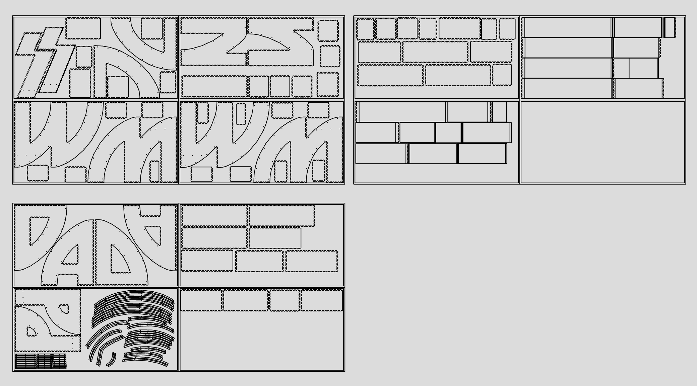

Enfin nous avons pu exporter ce document en format DXF avec le module d'export de OnShape.
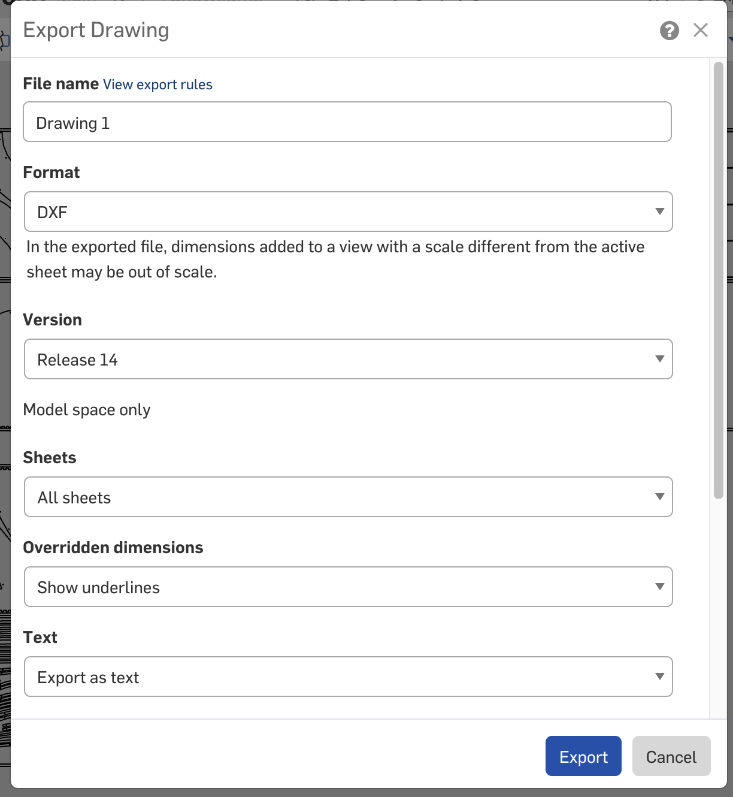

## Modifications dans Inkscape

Une fois le DXF exporté, nous avons pu l'ouvrir dans Inkscape pour continuer la conception pour la découpe laser.

Les pièces courbes ont été modifiées pour mettre en place un `Living Hinge` ([plus de détails](/technical_details/living_hinge.md)).

Les pièces ont été marquées par des numéros d'identifications à graver ([plus de détails](/technical_details/numerotation_pieces.md)).

Les dessins vectoriels ont été optimisés pour la gravure en passant par l'outil `Extensions > Modify Path > Cleanup Path`. Cela permet de fusionner les différents traits de coupe en un seul path continu afin que la découpeuse laser les traites dans un ordre optimal.

Comme expliqué dans les sections précédentes, la fonction `Sheet Metal Model` a créé des traits de coupe là où il ne fallait pas. Bien que nous ayons re-joint les pièces concernées, les traits de coupes existent encore. Nous avons donc supprimé ces traits depuis le document Inkscape (voir calque `TO_HIDE/Cuts_to_hide`).

Enfin pour finaliser le document pour la découpe nous avons sélectionné tous les traits de coupe puis:
- Nous les avons tous mis à une épaisseur de 0.001mm
- Nous avons mis en rouge tous les traits à couper
- Nous avons mis en bleu tous les traits liés au `Living Hinge`
- Nous avons mis en vert tous les traits de marquage des pièces