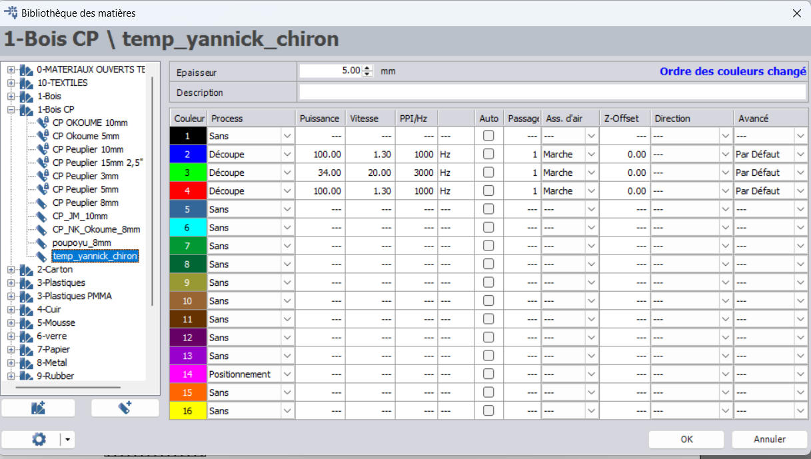

# Fichier de découpe

Le but de ce document est de décrire le contenu du fichier [LaserCutInkscape.svg](/src/LaserCutInkscape.svg) pour permettre de redécouper des pièces pour le logo de la conférence.

Le fichier de découpe est prévu pour être ouvert depuis Inkscape.

> [!WARNING]
> En cas d'ouverture depuis Illustrator, il faut vérifier qu'aucune mise à l'échelle n'a été effectuée automatiquement lors de l'import.

Le fichier de découpe est conçu pour du contreplaqué de 5mm d'épaisseur.

Le fichier est organisé par `plaques` de 1234mm par 610mm. Chaque plaque correspondant à 1/4 de plaque de contreplaqué du commerce, afin de tenir dans les dimensions maximales possibles avec la [découpeuse laser Trotec 500](https://fablab.lacasemate.fr/#!/machines/trotec-speedy-400-laser) du FabLab de Grenoble.

Chaque `plaque` est composée de:
- Un groupe de calques nommé `Plaque XX` qui contient:
  - En rouge: les lignes de découpes des différentes lettres
  - En bleu: les lignes de découpe des motifs des living-hinges
    - Ces lignes auraient pu être rouges car c'est la convention de la découpeuse laser, mais il a été décidé de les mettre en bleu pour permettre de forcer l'ordre de découpe depuis le logiciel `Job Control` si besoin
  - En jaune: le cadre de délimitation de la plaque. Ce cadre ne sert que pour la conception et doit être ignoré à la découpe
- Un groupe de calques nommé `Textes_hershey/plaque XX` qui contient:
  - En vert: les annotations de gravures pour identifier les pièces découpées ([plus de détails](/technical_details/numerotation_pieces.md))

## Découpe des pièces au FabLab de Grenoble

> [!WARNING]
> Une formation à la découpe laser est nécessaire pour pouvoir accéder aux machines du FabLab

Pour découper une plaque au fablab de Grenoble, utiliser l'ordinateur rattaché à la Trotec 500 puis:
- Ouvrir le fichier Inscape
- Cacher toues les groupes de calques sauf les groupes `Plaque XX` et `Textes_hershey/plaque XX` correspondant à la plaque à découper
- (optionnel) Cacher le calque de délimitation jaune de la plaque
- (optionnel) Déplacer le contenu des groupes de calques dans le coin en haut à gauche du document
- Utiliser le module d'impression pour envoyer les instructions de découpe au logiciel `Job Control`
- Appliquer les paramètres de découpe suivants:

- Préparer la découpeuse laser (insertion de la plaque, calibration, positionnement du job de découpe) puis lancer la découpe

> [!TIP]
> La surface de découpe étant grande, il est possible que la plaque de contreplaqué soit gondolée. Si c'est le cas s'aider des cales du Fablab pour plaquer le contreplaqué. Si cela n'est pas suffisant, alors modifier le fichier pour découper sur des surfaces plus petites.