# Peinture

L'objectif était de peindre les lettres SNOW en blanc et les lettres CAMP en jaune.

## Sous-couche

Pour préparer les pièces nous avons appliqué 3 couches de sous-couche blanche avec un ponçage léger après chaque couche pour enlever les fibres du bois qui se sont relevées ainsi que les éventuelles coulures.

Le contreplaqué absorbe beaucoup la peinture donc les 3 couches se sont avérées nécessaires.

Nous avons utilisé de la [Sous-couche bois LUXENS blanc 0.5 L](https://www.leroymerlin.fr/produits/sous-couche-bois-luxens-blanc-0-5-l-84024431.html) à base d'eau pour avoir le moins de vapeurs toxiques mais aussi pour que les outils soient plus faciles à nettoyer

  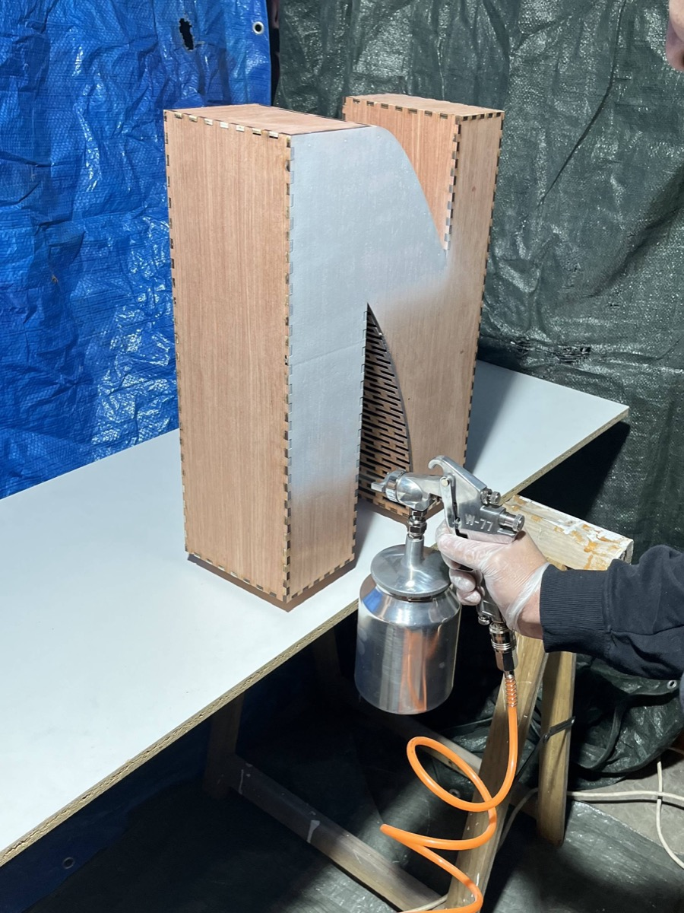
  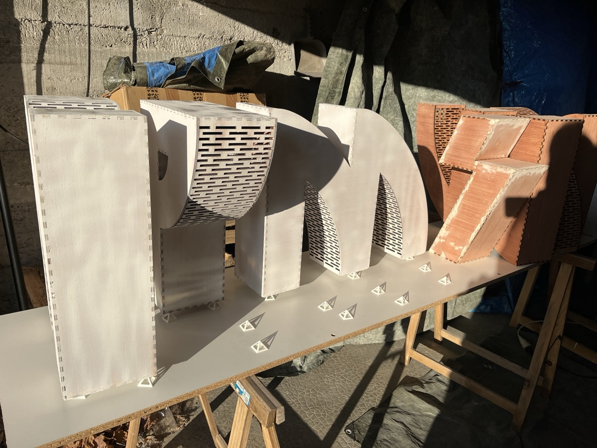

## Couche

Nous avons ensuite appliqué les couches de peinture blanches et jaunes, avec un léger ponçage entre les couches.

Le nombre de couches a été en fonction du rendu obtenu. Pour certaines pièces 2 couches ont suffi, pour d'autres nous sommes montés à 3 couches.

Pour le blanc nous avons utilisé de la [Peinture mur, boiserie, radiateur blanc mat LUXENS, 2.5L](https://www.leroymerlin.fr/produits/peinture-mur-boiserie-radiateur-blanc-mat-luxens-2-5l-84864770.html), toujours à base d'eau pour les mêmes raisons que pour la sous-couche.

Pour le jaune, nous avons dans un premier temps effectué des recherches pour identifier la couleur nécessaire. En partant de notre logo et en le comparant à un nuancier nous avons trouvé que la couleur la plus proche était le [RAL 1021](https://www.couleursral.fr/ral-classic/ral-1021-jaune-colza).
Nous avons ensuite trouvé et commandé la peinture [Peinture Mur Et Plafond - Jaune colza - RAL 1021 - 1 L - Métaltop](https://www.leroymerlin.fr/produits/peinture-mur-et-plafond-jaune-colza-ral-1021-1-l-metaltop-97684230.html) toujours à base d'eau, mais suite à un problème de livraison et face aux échéances de la conférence arrivant à grand pas, nous nous sommes rabattu sur des [Bombe de peinture acrylique Coversall 400 ml - n° 165 Jaune Signal](https://dalbe.fr/products/peinture-acrylique-coversall-400-ml-molotow) au magasin d'art local de Grenoble.

  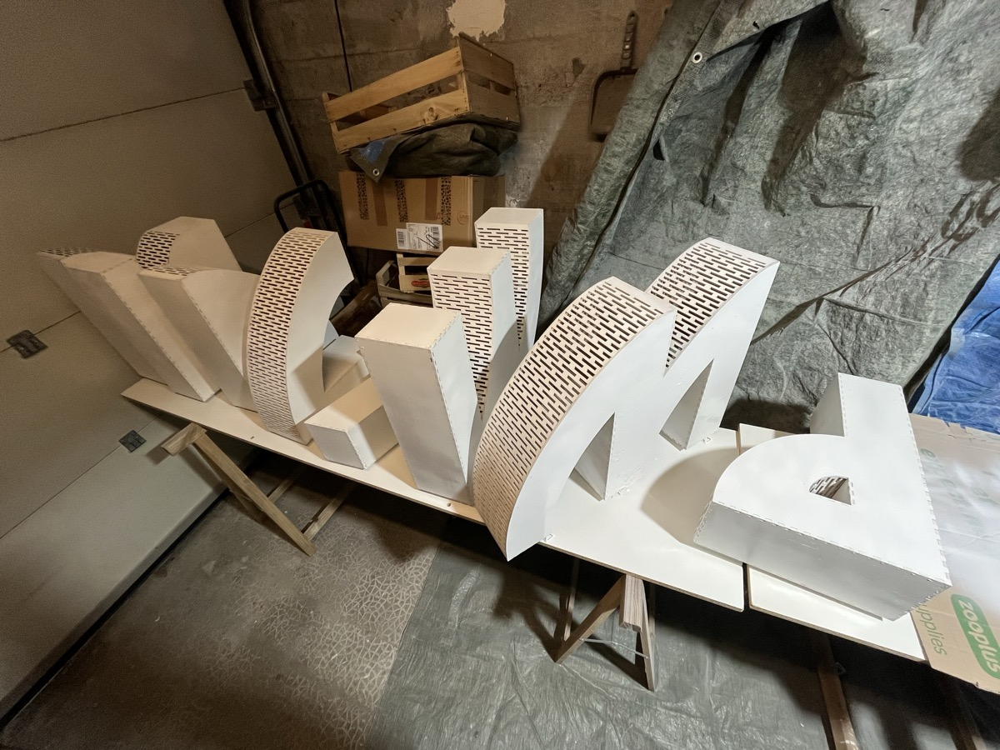
  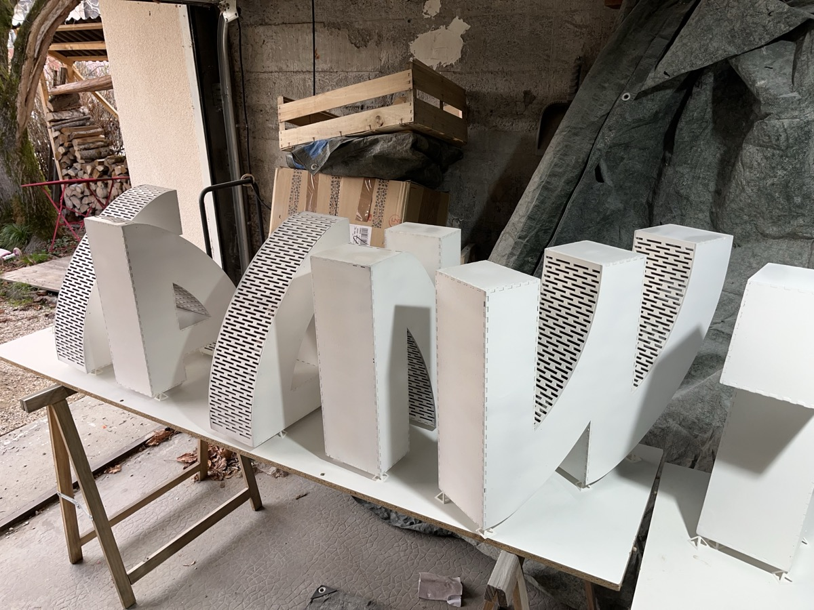
  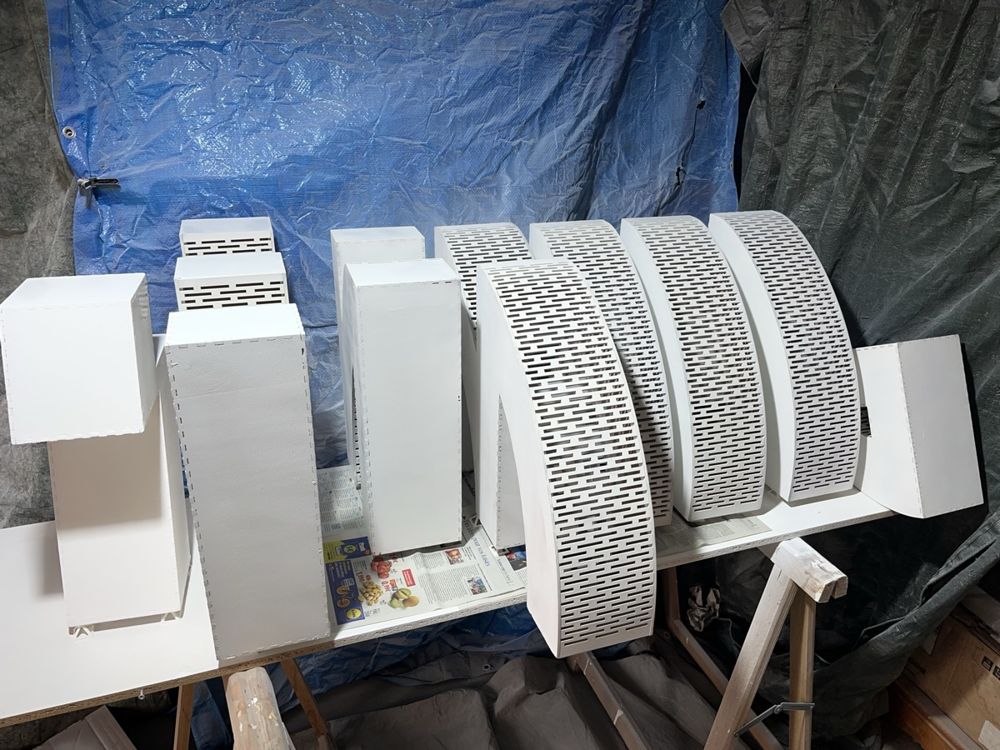
  
  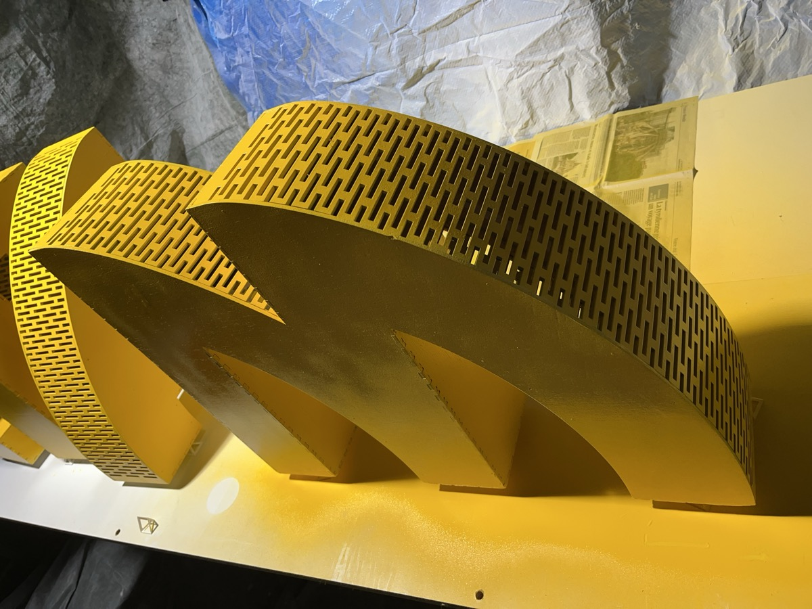

## Vernis

Pour finir nous avons appliqué 2 couches de vernis brillant sur chaque pièce. Le but premier était d'avoir une couche de protection pour la peinture car les pièces allaient régulièrement être transportées (1 fois par an).

Nous avons utilisé des [Bombes de vernis Multisupports LUXENS brillant 400 ml](https://www.leroymerlin.fr/produits/vernis-en-bombe-aerosol-multisupports-luxens-brillant-400-ml-82991135.html).

## Pistolet

Pour appliquer les couches de sous-couche et de peinture à l'eau, nous avons utilisé un compresseur et un pistolet à peinture. C'était une première fois pour nous.

Les premières couches ont été assez difficiles avec un flux aléatoire, quelques coulures mais surtout le pistolet qui avait tendances à se boucher.

Après quelques essais et erreurs, nous avons réalisés que la dilution que nous avions faite n'était pas suffisante. Une fois le taux de dilution augmenté nous avons réussi à avoir de meilleurs résultats.

Les points que nous avons retenu:
- Avoir une dilution suffisante pour un flux homogène et éviter de boucher le pistolet
- Garder le pistolet suffisamment loin de la surface pour éviter les coulures
- Préférer les mouvements lents aux mouvements rapides pour couvrir les surfaces
- Avoir une surface de test (ex: carton) pour réaliser les réglages du pistolet
- Pour notre modèle garder le compresseur entre 50bar et 100bar
- Insister sur les coins/angles des pièces car les tranches du contreplaqué absorbent beaucoup la peinture ce qui atténue la couleur

Aussi nous avons pu comparer la facilité d'application de la peinture au pistolet par rapport à l'utilisation de bombes. Les bombes sont vraiment plus faciles à appliquer avec peu de temps de préparation, un réglage directement optimal, un rendu plus fin et pas d'étape de nettoyage à la fin. Cependant nous avons aussi remarqué que les bombes avaient une odeur beaucoup plus forte et volatile (malgré le garage fermé l'odeur a rempli toute la maison), un impact sur l'environnement est plus fort, plus de déchets (si on ne prend pas en compte le compresseur), et un coût supérieur pour une même surface.

## Masque

Il est important de noter, que même si nous appliquions de la peinture à eau, l'utilisation de masques à vapeur était vivement recommandée vu la quantité de particules en suspension dans la pièce.

Lors de l'utilisation des bombes de peinture jaune et de vernis, l'utilisation de masque était carrément obligatoire, ces produits ayant des vapeurs très volatiles et toxiques.

Pour ce faire nous avons utilisé des [Masque de protection anti-vapeur A1 MECAFER](https://www.entrepot-du-bricolage.fr/p/pr-masque-de-protection-anti-vapeur-a1-mecafer-1068893).

## Supports

Pour éviter que les pièces ne collent au plan de travail, nous avons imprimé en 3D des petits supports pour les surélever.

Le modèle utilisé est le suivant: https://makerworld.com/en/models/156659-paint-spraying-stand-ultralight-and-strong

https://github.com/user-attachments/assets/3799d83e-4b09-49ea-a496-6b5aec33c3d7

  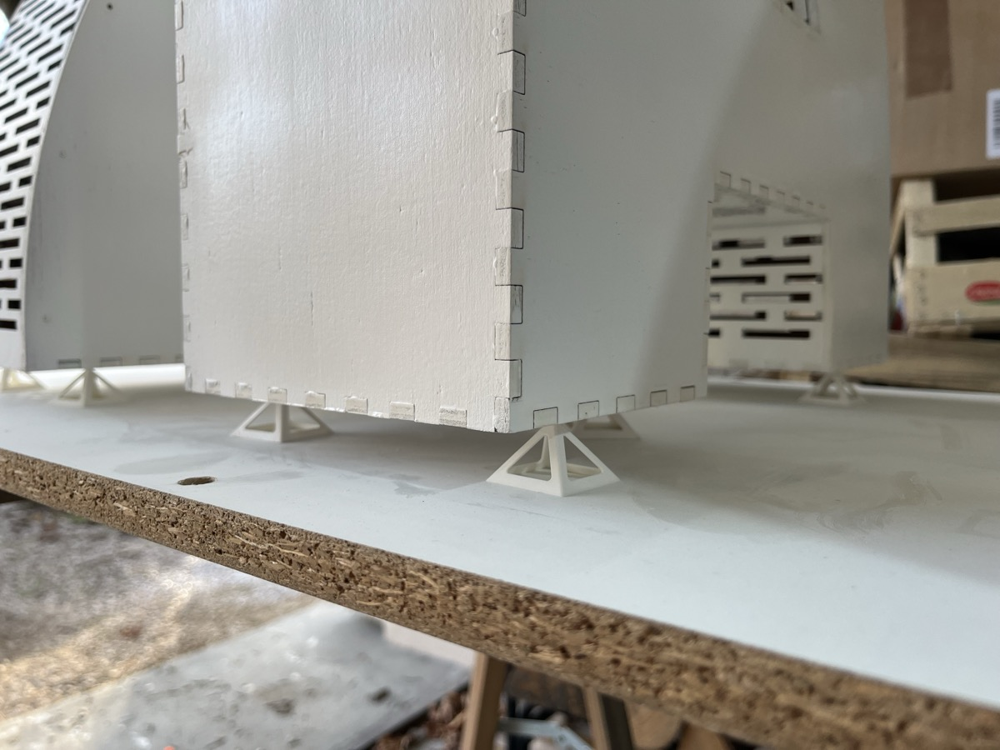
  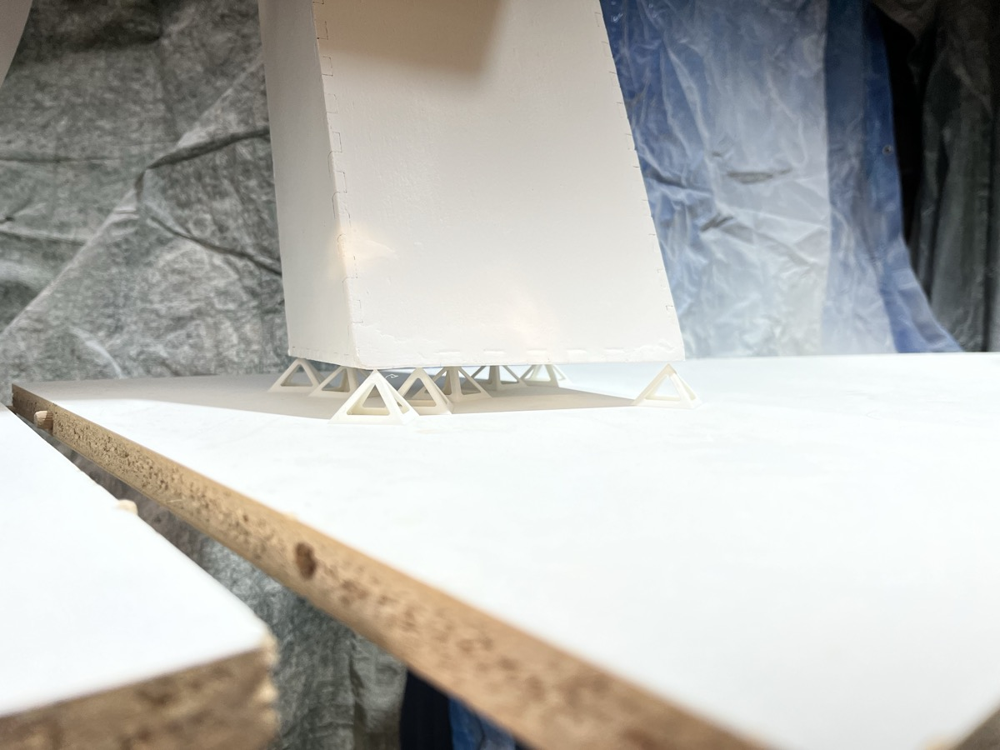
  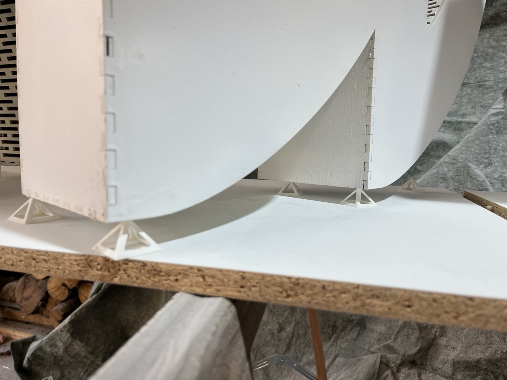

## Erreurs

Voici quelques erreurs notables que nous avons faites et qui pourraient être améliorée si nous venions à faire un projet similaire.

La première concerne les jointures. Nous pensions que la peinture serait suffisamment épaisse pour cacher les jointures entre les pièces de contreplaqué mais cela n'a pas été le cas. Avec le recul il aurait été intéressant d'appliquer une couche de rebouche bois au niveau des jointures pour avoir un résultat plus propre.

  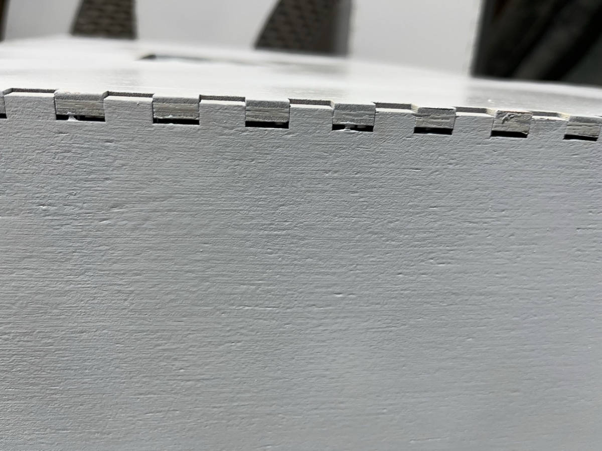
  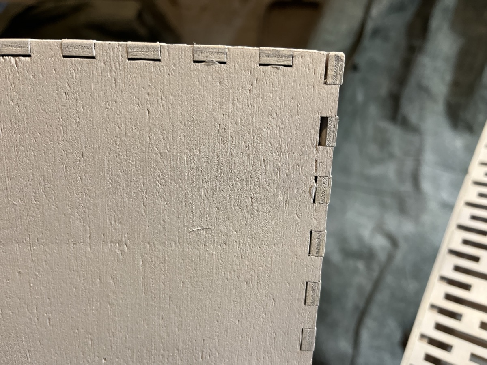

Un second problème a été au niveau des surface de contreplaqué. Certaines ont vu leur fibre mise en exergue une fois la peinture appliquée. Nous pensons que c'est dû à l'eau dans la peinture qui en relevant les fibres a aussi mis en évidence les défauts du bois. Peut-être qu'un meilleur ponçage aurait évité un tel problème. 

  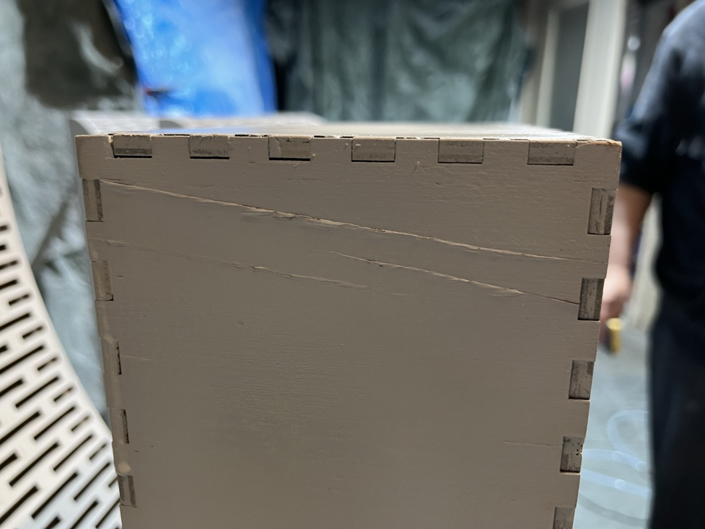

Pendant la peinture nous avons été confrontés à de nombreuses coulures. Nous avons tenté de rattraper certaines couleurs alors que la peinture avait figé mais n'était pas complètement sèche et cela a plus empiré le problème. Il est donc important de récupérer les coulures soit le plus rapidement après l'application de la peinture, soit d'attendre que la peinture sèche complètement pour poncer le surplus.

Enfin nous nous sommes rendu compte sur la fin du projet que les angles des pièces avaient un aspect délavé. Cela a été dû aux tranches du contreplaqué qui absorbe plus la peinture que les autres parties. La peinture dans ces zones n'a donc pas pu cacher complètement le contreplaqué. Il aurait fallu qu'on insiste plus sur ces zones lors de l'application au pistolet.
