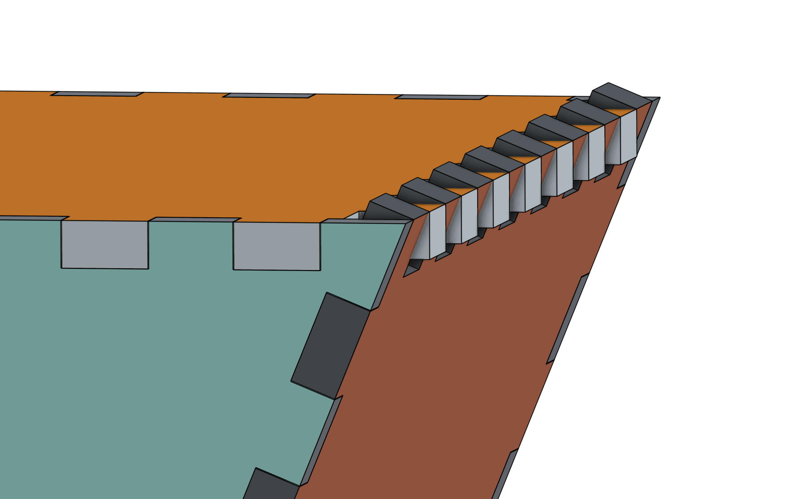
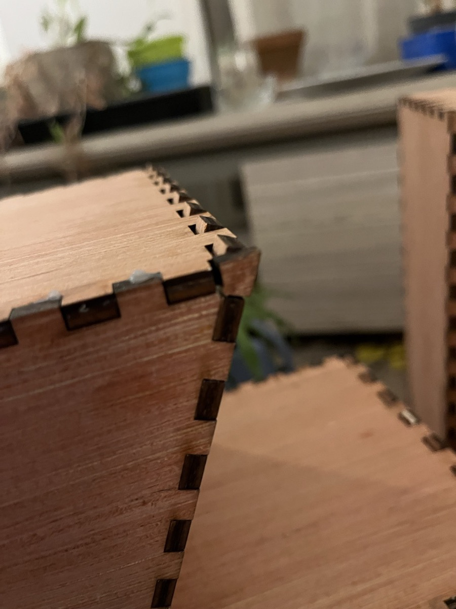
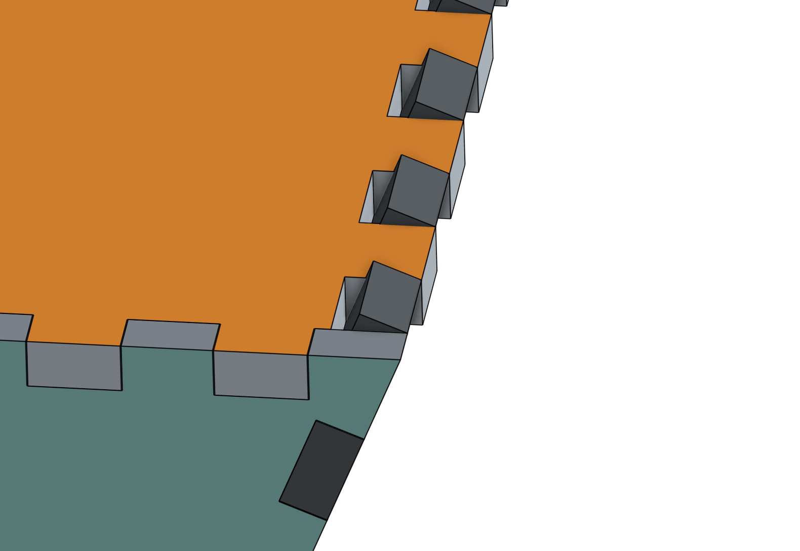
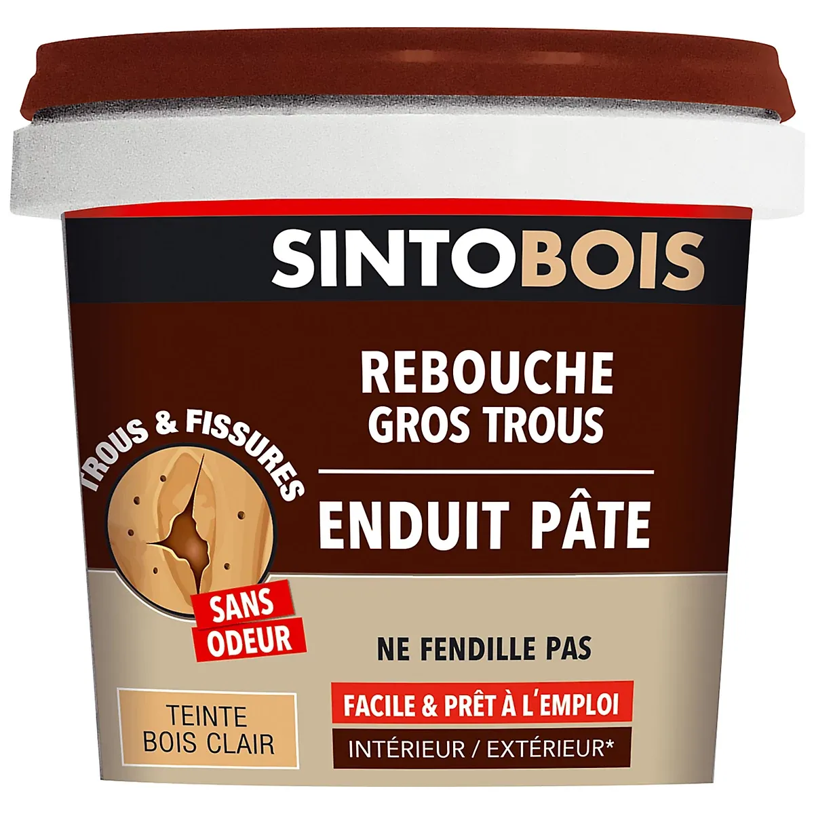

# Gestion des angles aigus

Le projet utilise des jonctions en `Box Joint` pour assemble les pièces de contreplaqué entre elles.

La limitation de ce type de jonction est que s'il fonctionne bien pour les angles droits, ce n'est pas le cas pour les angles aigus. Lorsqu'on assemble 2 pièces en angle aigu, l'épaisseur du contreplaqué va faire que les dents du `Box Joint` vont ressortir de l'angle:

  
   

Un autre effet de bord est qu'un trou est présent entre la pièce de contreplaqué et les dents de l'autre pièce.

  

## Ponçage / Rabotage

Pour compenser ce problème nous avons dû couper les dents qui dépassent à ras de la surface.

Pour se faire nous avions à disposition un rabot électrique et une ponceuse à bande.

Après quelques essais il s'est avéré que le rabot électrique pouvait être compliqué à régler pour avoir un résultat propre et répétable.

A contrario, placer la ponceuse à bande sur le dos et la bloquer en position marche a permis d'avoir une surface de travail contre laquelle nous sommes venu poser l'angle des pièces à aplanir.

Chaque angle a pu être aplani en quelques secondes et de façon reproductible.

## Rebouche bois

Pour compenser les trous générés par les angles aigus, nous avons utilisé du rebouche bois spécial gros trous de la marque Sintobois ([ref](https://www.castorama.fr/enduit-pate-rebouche-gros-trous-sintobois-bois-clair-500g/3169980390017_CAFR.prd))

  

Nous avons appliqué le produit avec deux vielles cartes de fidélité en plastique pour obtenir des surfaces droites et des angles à peu près propres.

Une fois séché, nous avons poncé la surface pour avoir un rendu propre.

Le rendu final était plutôt propre. Les arrêtes des angles n'étaient pas complètement droites mais avec un peu d'entrainement et de persévérance nous aurions pu obtenir un résultat vraiment propre. Il aurait fallu mettre plus de quantité de matière puis utiliser une ponceuse pour obtenir des surfaces planes et donc des arrêtes droites.

La quantité de rebouche bois utilisée a été assez faible, probablement une 50aine de grammes.

> [!TIP]
> Nous n'avons rebouché que les angles aigus de la lettre S, mais suite à notre expérience nous aurions dû en profiter pour reboucher toutes les jointures des différentes pièces ainsi que les empreintes formées par les cure-dents.
