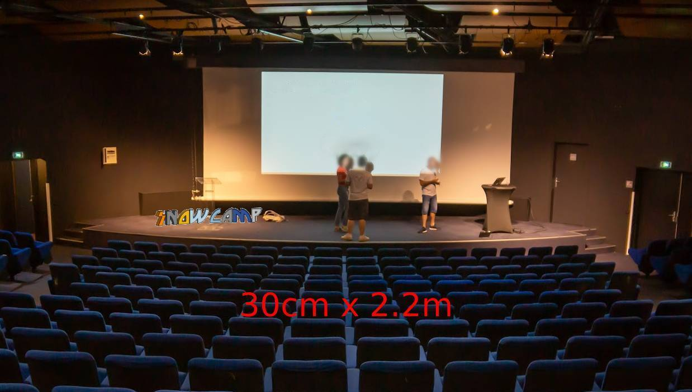
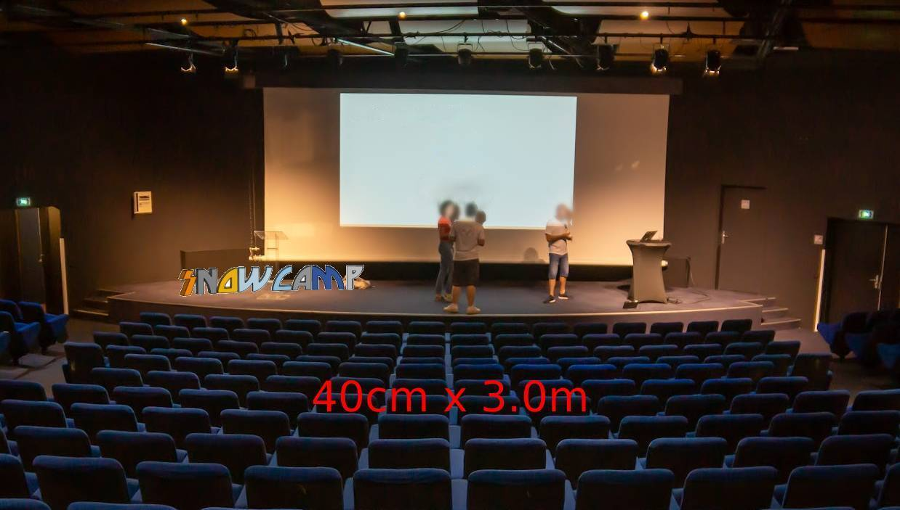
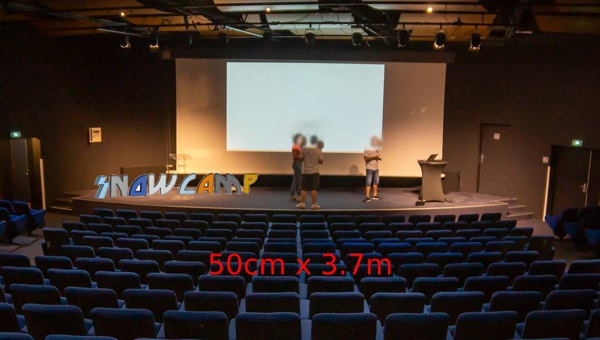
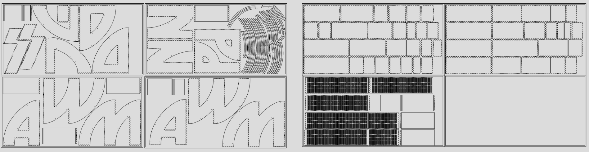
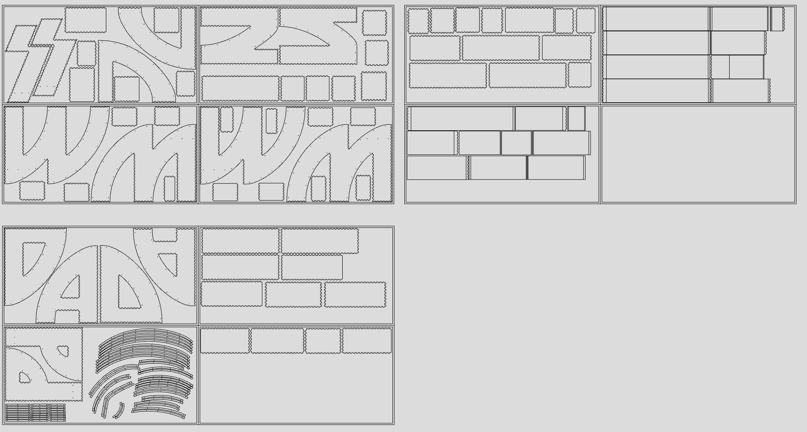
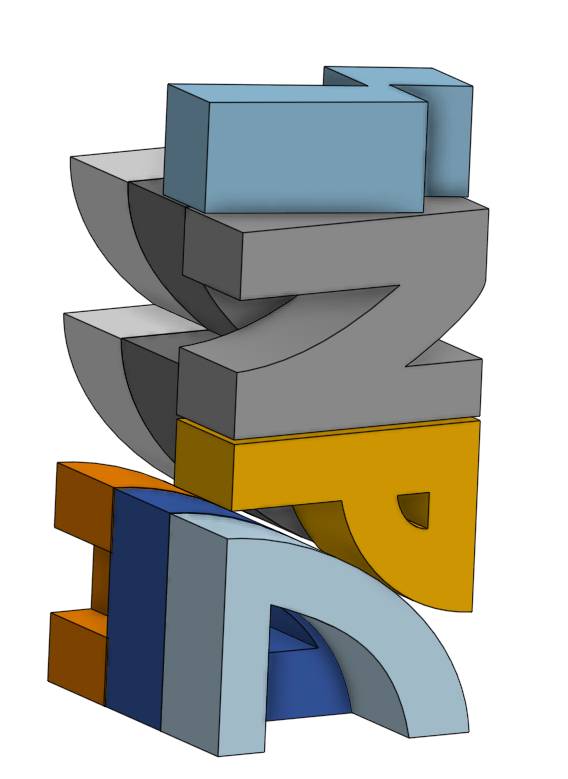
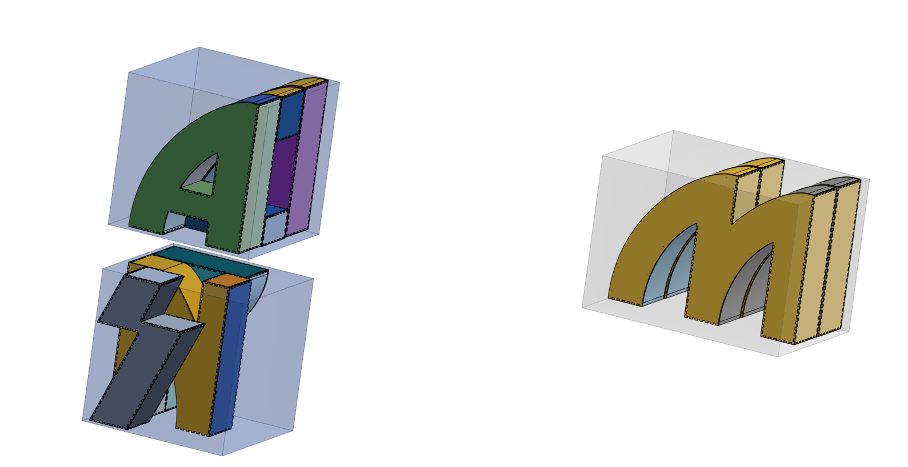

# Dimensions

Le choix des dimensions s'est fait en plusieurs étapes.

Une première modélisation "grosse maille" des lettres a été faite dans OnShape au début du projet afin de simuler plusieurs tailles.

Les dimensions suivantes sont ressorties:
- 30cm de haut = 2.2m de large pour le logo complet
- 40cm de haut = 3m de large
- 50cm de haut = 3.7m de large
- 60cm de haut = 4.4m de large

Une simulation a été faite avec des photos de la scène lors d'anciennes conférences:

  
   
  

Dans une deuxième phase nous avons pu visiter le lieu et faire des mesures plus précises ainsi que de s'assoir à différents endroits de la salle pour voir si certaines tailles pouvaient gêner la vision des participants.

Suite à cette visite nous sommes partis sur l'option 50cm de haut.

## Considération liées à la découpeuse laser

La découpeuse laser du FabLab de Grenoble peut travailler sur une surface maximum de 1234mm par 620mm. Il est donc nécessaire que les lettres puissent tenir facilement dans ces dimensions.

Aussi plus les lettres sont grosses, plus elles prennent de l'espace sur la surface de découpe, et plus il devient difficile d'optimiser l'espace en découpant plusieurs lettres par plaque de contreplaqué.

Par exemple entre des pièces de 40cm de haut et des pièces de 50cm de haut, il aurait été possible d'économiser 1 plaque entière de contreplaqué soit une 30aine d'euros économisables en plus du temps de découpe moindre.

Lettres de 40cm:

Lettres de 50cm:

Aussi sur des lettres de 60cm, il devenait compliqué d'imprimer les lettres W et M vu l'espace qu'elles prenaient en largeur.

## Considérations de stockage

Il a été aussi calculé le volume qui serait pris pour un stockage optimal des pièces:
- 40cm de haut = peut être stocké dans un volume de 40 * 45 * 95cm
- 50cm de haut = peut être stocké dans un volume de 50 * 60 * 120cm
- 60cm de haut = peut être stocké dans un volume de 60 * 60 * 140cm

Configuration pour stocker les lettres dans un volume le plus restreint possible:

Mais il a été décidé ensuite de stocker dans plusieurs cartons pour un transport plus léger.

Après quelques recherches nous avons trouvé un site de vente de cartons qui faisait des cartons de 50x50x50cm et des cartons de 50x50x60~100cm (la 3ème dimension étant adaptable).

La hauteur des pièces a donc été adaptée et réduite à 49cm pour laisser un peu de marge.

## Profondeur des lettres

Une fois la hauteur des lettres choisie, il a fallu définir leur profondeur.

Lorsqu'on se renseigne sur internet, il est conseillé d'avoir une base de dimension égale à 1/3 ou plus de la hauteur afin d'assurer une stabilité correcte.

Pour une hauteur de 49cm il faudrait donc une profondeur de 16,33cm.

Nous avons réfléchi à arrondir à 17cm, cependant cela voulait dire que 3 lettres stockées côte à côte auraient fait 51cm, soit 1cm de trop pour rentrer dans les cartons qu'on trouve dans le commerce. Nous n'avons pas trouvé d'autres cartons plus adaptés, donc l'option 17cm n'était pas envisageable.

Nous avons préféré arrondir à 16cm pour que cela tienne dans un carton de 50cm avec suffisamment de marge pour pouvoir manipuler les pièces et les insérer sans frottement. C'est un peu en dessous des recommandations mais tout de même suffisant pour avoir un équilibre correct.

## Largeur des lettres

Comme nous nous sommes basés sur un logo existant, la largeur des lettres est directement pilotée par leur hauteur. Donc nous n'avons pas eu de choix à faire à ce niveau, si ce n'est que de vérifier que les largeurs restaient acceptables pour la découpe, la manipulation et le stockage.