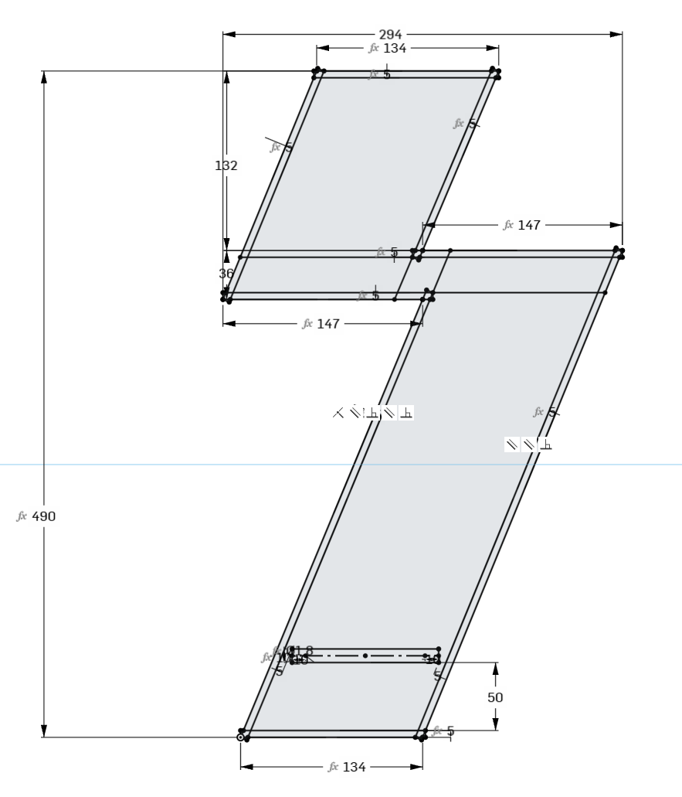
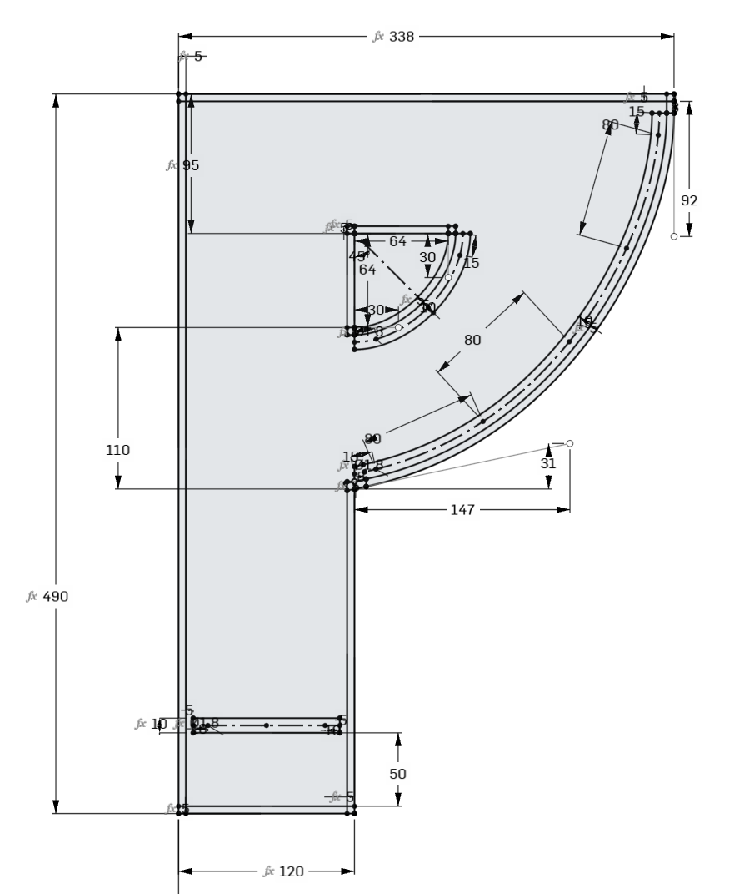
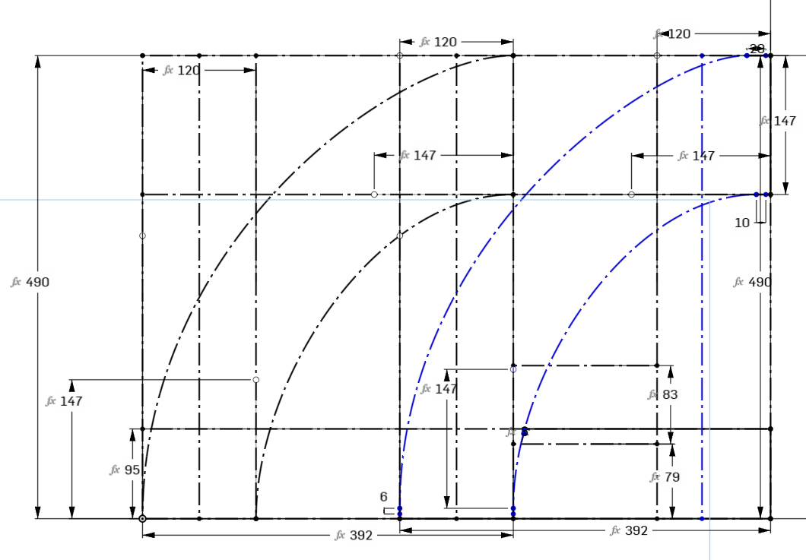
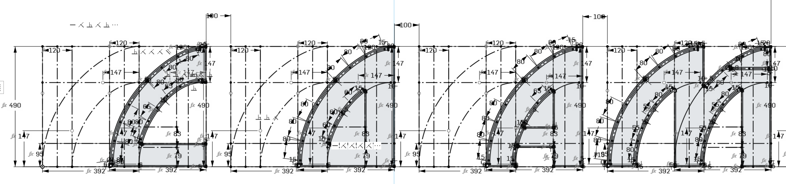
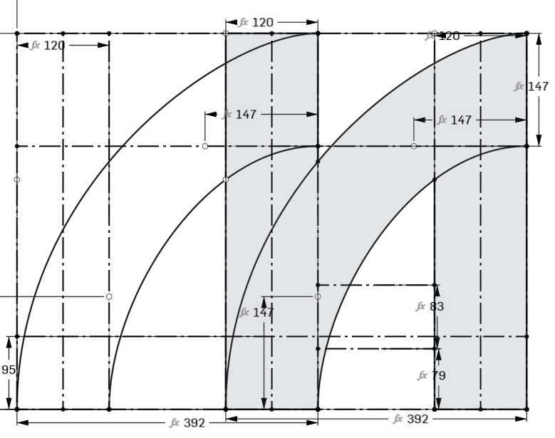
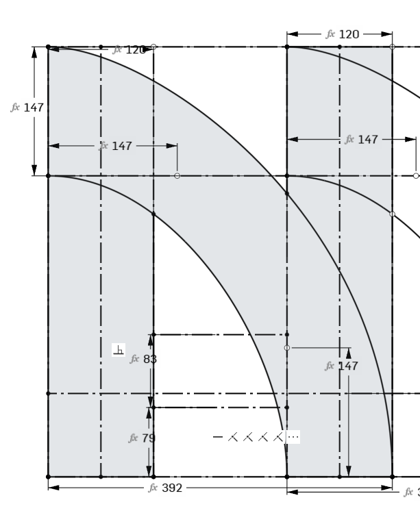
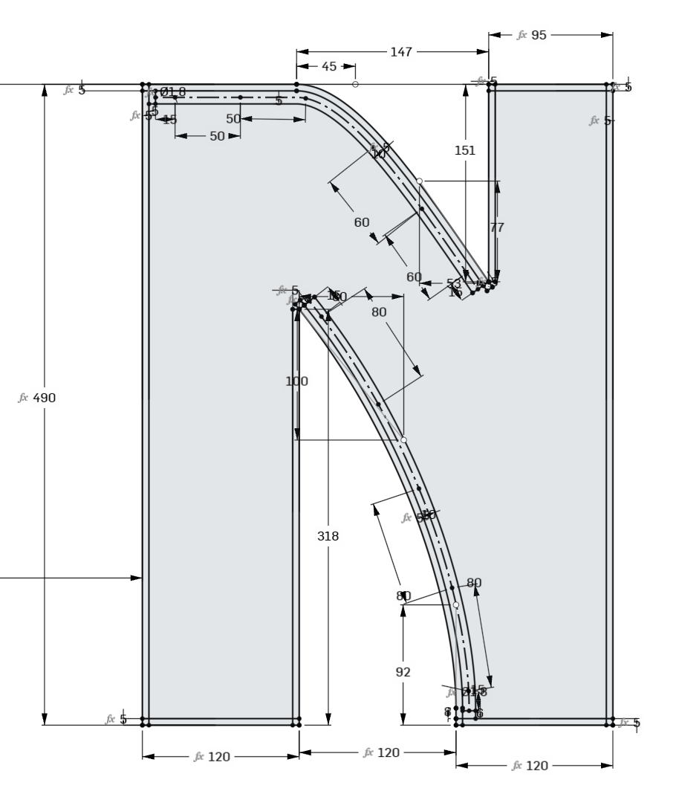

# Vectorisation de notre logo

La première étape a été de partir de notre logo PNG et de le vectoriser dans OnShape.

Notre logo avait été créé depuis la police d'écriture [Die Nasty](https://www.dafont.com/die-nasty.font)

La vectorisation a été faite manuellement dans un Sketch avec les objectifs suivants:
- Utiliser au maximum des primitives (droites, courbes de Bézier etc.)
- Utiliser au maximum des variables pour faciliter les potentiels redimensionnement futur
- Prendre en compte les contraintes liées à la découpe laser comme, par exemple, avoir au maximum des angles droits, donc terminer les courbes par un aplat léger
- Le choix a été fait d'homogénéiser les lettres pour avoir les mêmes courbes d'une lettre à l'autre afin de faciliter l'empilement au moment du rangement

Le résultat est le suivant:

## Lettres P et S
Le S et le P on été vectorisé de façon directe car ces lettres ne ressemblent à aucune autre.

## Lettres C, O, A, M et W
Les lettres C, O, A, M et W ont des similarité:
- Le C, le O et le A ont exactement la même forme extérieure: une base plate, le côté droit vertical (plein ou vide) et le côté gauche arrondi.
- Le W et le M sont exactement la même forme mais avec une rotation de 180°.
- Le W et le M ont les mêmes caractéristiques que le C, le O et le A, mais en double.

Cela a permis de mutualiser la vectorisation pour pouvoir générer toutes les lettres à partir du seul sketch suivant:

Ensuite en prenant en compte ou non les différentes lignes de construction, il est possible de générer les 4 variantes suivantes:

# Lettre N
La lettre N a demandé de faire un choix.

En première analyse il a été remarqué que la lettre N pouvait être construite depuis le même Sketch que pour le M.

On obtient un N inversé qu'il suffit ensuite de tourner à 180° sur l'axe horizontal.

Cette méthode semblait satisfaisante mais le résultat donnait un N trop neutre qui permet la stylisation du N d'origine.

Il a donc été décidé d'abandonner la première version et de partir sur une forme plus proche de celle d'origine:

